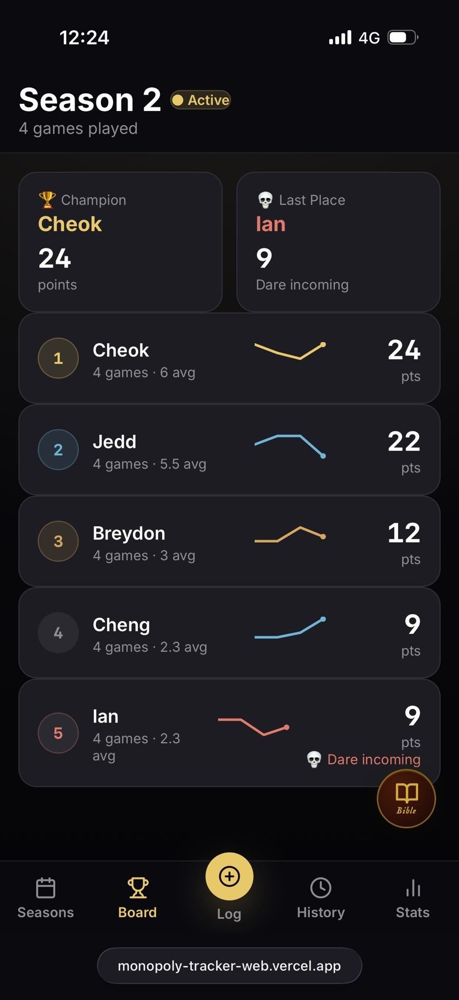
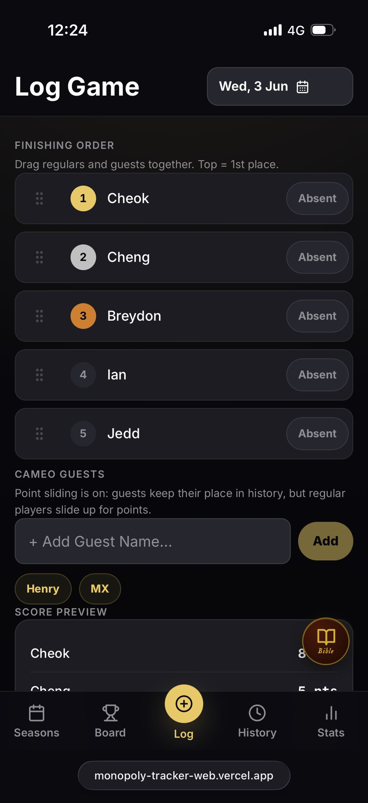
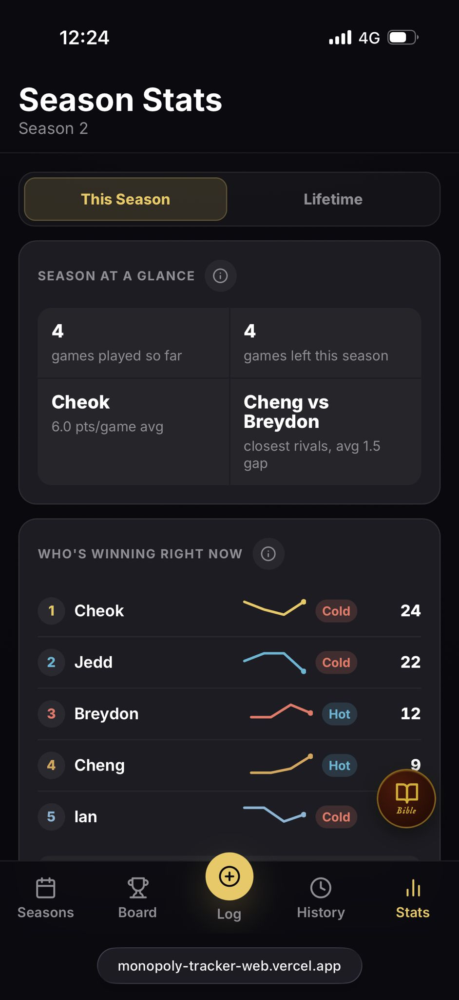
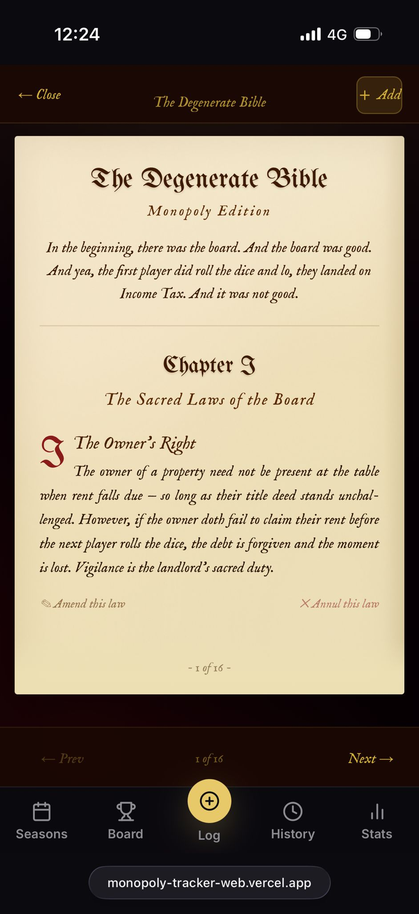

<div align="center">

# 🎩 MonoTracker

### Real-time multiplayer season tracking for competitive board games

[](https://react.dev)
[](https://vitejs.dev)
[](https://firebase.google.com)
[](https://vercel.com)
[](https://web.dev/progressive-web-apps/)
[](LICENSE)

**MonoTracker** is an open-source, real-time Progressive Web App for tracking competitive multiplayer game seasons. Built for friend groups who take their board game nights seriously — featuring live leaderboards, statistical analytics, season management, editable game history, and a custom rules system.

[**→ Try the Live Demo**](https://monopoly-tracker-web.vercel.app) · [Report Bug](https://github.com/sappyscooper/monopoly-tracker-web/issues) · [Request Feature](https://github.com/sappyscooper/monopoly-tracker-web/issues)

</div>

***

## ✨ Features

- **Real-time sync** — All data syncs instantly across every device via Firebase Firestore live listeners. No refresh needed.
- **Season management** — Create competitive seasons with defined player rosters, start/end dates, active-season switching, season ending, and season deletion.
- **Smart scoring engine** — Points are calculated with a top-heavy `8-5-3-2-1` ranking model. Cameo guests are skipped for scoring so regular players slide up and are ranked only against each other.
- **Live leaderboard** — Animated leaderboard with champion and last-place highlights, per-player game counts, average score tracking, and sparkline trend previews.
- **Statistical analytics dashboard** — Analytics suite including season snapshots, all-time standings, consistency scoring, podium records, head-to-head matrix, recent form guide, guest appearance tracking, and end-of-season point projections.
- **Game history** — Full log of every game with expandable details, monthly grouping, swipe-to-delete, and edit support for date, placements, absences, and cameo guests.
- **The Sacred Rules Bible** — A custom in-app rule book with an animated leather tome UI, Roman numeral chapters, page-turn animations, and the ability to add, edit, and remove custom house rules stored in Firestore.
- **Installable PWA** — Add to home screen on iOS or Android for a native-feeling app experience with no App Store required.
- **Dark mode** — Fully dark, premium mobile-first UI with a restrained champagne gold, ice blue, and coral rose accent palette.
- **Site-wide password gate** — The full app is blocked behind a shared session password, then stays interruption-free once unlocked for that browser session.

***

## 📸 Screenshots

> _Screenshots taken on mobile — live demo at [monopoly-tracker-web.vercel.app](https://monopoly-tracker-web.vercel.app)._

| Leaderboard | Log Game | Stats Dashboard | The Bible |
|:----------:|:---------:|:---------------:|:---------:|
|  |  |  |  |

***

## 🏗️ Tech Stack

| Layer | Technology |
|---|---|
| **Framework** | React 18 + Vite 5 |
| **Styling** | Tailwind CSS v4 + custom CSS tokens |
| **Backend / Database** | Firebase Firestore (real-time listeners) |
| **Drag and Drop** | dnd-kit |
| **Animations** | Framer Motion + react-spring |
| **Charts** | Recharts |
| **Icons** | Lucide React |
| **Routing** | React Router v6 |
| **PWA** | vite-plugin-pwa |
| **Deployment** | Vercel |

***

## 🚀 Getting Started

### Prerequisites

- Node.js 18+
- npm 9+
- A Firebase project with Firestore enabled

### 1. Clone the repository

```bash
git clone https://github.com/sappyscooper/monopoly-tracker-web.git
cd monopoly-tracker-web
```

### 2. Install dependencies

```bash
npm install
```

### 3. Configure Firebase

Create a Firebase project at [console.firebase.google.com](https://console.firebase.google.com). Enable **Firestore Database**.

Create `src/firebase.js` with your project config:

```js
import { initializeApp } from "firebase/app";
import { getFirestore } from "firebase/firestore";

const firebaseConfig = {
  apiKey: "YOUR_API_KEY",
  authDomain: "YOUR_PROJECT.firebaseapp.com",
  projectId: "YOUR_PROJECT_ID",
  storageBucket: "YOUR_PROJECT.appspot.com",
  messagingSenderId: "YOUR_SENDER_ID",
  appId: "YOUR_APP_ID",
};

const app = initializeApp(firebaseConfig);
export const db = getFirestore(app);
```

### 4. Set up Firestore Security Rules

For the simplest friend-group deployment, Firestore can be configured as publicly readable and writable while the app UI protects the entire app with a session password gate:

```txt
rules_version = '2';
service cloud.firestore {
  match /databases/{database}/documents {
    match /{document=**} {
      allow read: if true;
      allow write: if true;
    }
  }
}
```

> **Note:** This app uses a site-wide session password gate. The app is not accessible without the password, which resets on each new browser session (new tab or page refresh). Write actions require no additional authentication once inside. For production use with multiple teams, consider replacing this with Firebase Authentication.

### 5. Configure your players and site password

Open `src/components/SitePasswordGate.jsx` and set your password:

```js
const ADMIN_PASSWORD = 'your-password-here';
```

Open `src/pages/SeasonsPage.jsx` and update the default player list:

```js
const DEFAULT_PLAYERS = ['Player1', 'Player2', 'Player3', 'Player4', 'Player5'];
```

### 6. Run locally

```bash
npm run dev
```

Open [http://localhost:5173](http://localhost:5173).

### 7. Deploy to Vercel

```bash
npm install -g vercel
vercel --prod
```

For this repository's existing production project, deploy with:

```bash
npx vercel --prod --yes --scope sappyscoopers-projects
```

***

## 📐 Scoring Algorithm

MonoTracker uses a **Top-Heavy Point Sliding** scoring model designed for a five-player friend group. It rewards high finishes while keeping lower-ranked players mathematically alive.

**Base points table:**

| Place | Points |
|-------|--------|
| 1st | 8 |
| 2nd | 5 |
| 3rd | 3 |
| 4th | 2 |
| 5th | 1 |

The scoring engine ranks regular players only against other regular players:

```txt
regularRank = position among non-cameo players
points = BASE_POINTS[regularRank] ?? 1
```

### Cameo guests

Cameo guests can be placed anywhere in the finishing order, but they are excluded from the final scoreboard. This creates a point sliding rule:

- If a cameo finishes 1st, the highest regular player still receives 1st-place points.
- If a cameo finishes between two regular players, the regular players below them slide up for scoring.
- Cameos are retained in game history and guest appearance stats, but they never earn points and never steal points from regular players.

Example:

| Actual Finish | Player | Type | Score Result |
|---|---|---|---|
| 1st | Alex | Cameo | No points |
| 2nd | Cheok | Regular | 8 pts |
| 3rd | Jedd | Regular | 5 pts |
| 4th | Ian | Regular | 3 pts |
| 5th | Breydon | Regular | 2 pts |
| 6th | Cheng | Regular | 1 pt |

Absent regular players are appended to the end of the game and receive the lowest available regular-player score.

***

## 🗂️ Project Structure

```txt
src/
├── components/              # Reusable UI components
│   ├── BibleFAB.jsx
│   ├── BottomNav.jsx
│   ├── GamePlacementRows.jsx
│   ├── GlassCard.jsx
│   ├── SitePasswordGate.jsx
│   └── ...
├── hooks/                   # Custom React hooks
│   ├── useAdminAuth.js      # Module-level site gate session state
│   ├── useAllGames.js       # Firestore all-games listener
│   ├── useGames.js          # Firestore games listener for one season
│   ├── useRules.js          # Firestore rules listener and rule mutations
│   ├── useSeasons.js        # Firestore season listener
│   └── useScrollVisibility.js
├── pages/                   # Route-level page components
│   ├── HistoryPage.jsx
│   ├── LeaderboardPage.jsx
│   ├── LogGamePage.jsx
│   ├── RulesPage.jsx
│   ├── SeasonsPage.jsx
│   └── StatsPage.jsx
├── styles/
│   └── tokens.js            # Design system color/spacing tokens
├── utils/
│   ├── gameForm.js          # Placement editing and cameo-name helpers
│   └── scoring.js           # Shared scoring engine
├── App.jsx                  # Router + layout
├── firebase.js              # Firebase initialization
├── index.css                # Global app styling
├── main.jsx                 # Entry point
└── pwaUpdates.js            # Service worker update handling
```

***

## 🤝 Contributing

Contributions, issues and feature requests are welcome. Feel free to check the [issues page](https://github.com/sappyscooper/monopoly-tracker-web/issues).

1. Fork the project
2. Create your feature branch (`git checkout -b feature/AmazingFeature`)
3. Commit your changes (`git commit -m 'Add some AmazingFeature'`)
4. Push to the branch (`git push origin feature/AmazingFeature`)
5. Open a Pull Request

***

## 📄 License

Distributed under the MIT License. See [`LICENSE`](LICENSE) for more information.

***

## 🙏 Acknowledgements

- [Firebase](https://firebase.google.com) — Real-time database infrastructure
- [Vercel](https://vercel.com) — Deployment and hosting
- [Framer Motion](https://www.framer.com/motion/) — Animation library
- [dnd-kit](https://dndkit.com) — Drag-and-drop interactions
- [Lucide Icons](https://lucide.dev) — Icon set
- [Recharts](https://recharts.org) — Chart components
- [Vite PWA Plugin](https://vite-pwa-org.netlify.app/) — PWA tooling
